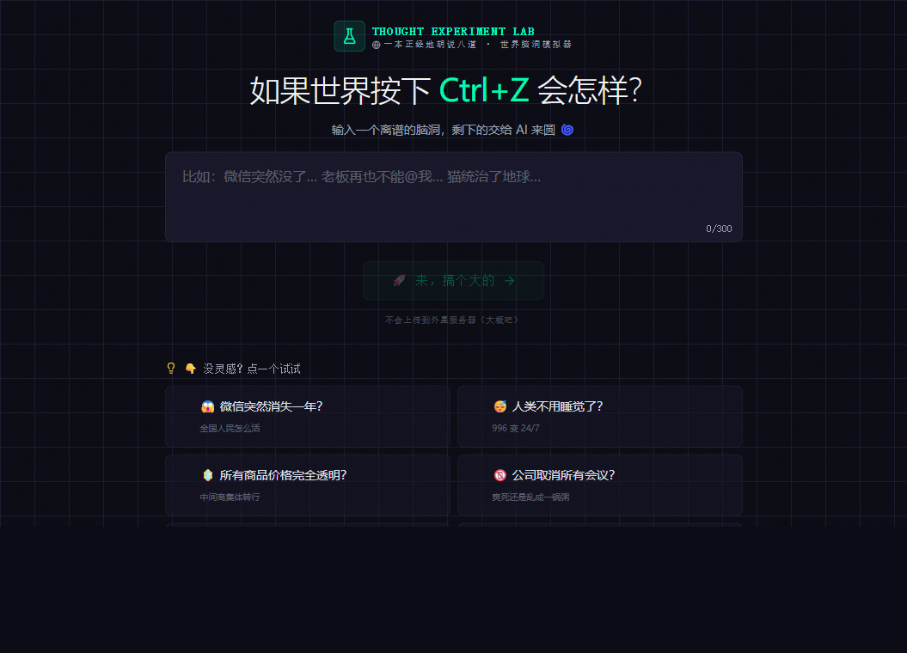

<div align="center">

# 🧪 Thought Experiment Lab · 脑洞实验室

**一本正经地胡说八道 · 世界脑洞模拟器**

*Change one variable, run another world.*

[🌐 Live Demo](https://brain.yanyanyan.com.cn) · [📖 About](#about) · [🚀 Quick Start](#quick-start)

</div>

---



---

## About

**English:**
Thought Experiment Lab is a world simulation interface for structured thought experiments. You propose a hypothesis in the form of *"What if [one variable changed]?"*, and the AI-powered engine will:

- 🔬 **Parse** your hypothesis into a structured experiment config (subject, change, duration, scope, adaptation speed, etc.)
- 🌍 **Simulate** a parallel world where your variable is different — generating causal chains, timelines, and unexpected side effects
- 📊 **Analyze** the results — dependency graphs, winners & losers, breaking points, constraint conflicts, and final insights
- 🎭 **Present** three possible worldlines (optimistic / pessimistic / absurd) with dark sci-fi flavored narratives

**中文：**
脑洞实验室是一个结构化的思维实验世界模拟界面。你提出一个「如果……会怎样」的假设，AI 引擎会：

- 🔬 **解析** 你的假设为结构化实验配置（对象、变化、时长、范围、适应速度等）
- 🌍 **模拟** 一个变量不同的平行世界 — 生成因果链、时间线、意想不到的连锁反应
- 📊 **分析** 结果 — 依赖关系图、赢家与输家、崩溃临界点、约束冲突、终极洞察
- 🎭 **呈现** 三种可能的世界线（乐观 / 悲观 / 荒诞），配以暗黑科幻风格的叙事

---

## ✨ Features / 功能特性

| Feature | Description |
|---------|-------------|
| 🧠 AI-Powered Simulation | InfiniSynapse LLM generates rich, coherent world simulations |
| 📋 Structured Experiments | Configurable subjects, variables, scopes, durations |
| 🕸️ Dependency Graphs | Visualize how changes cascade through interconnected systems |
| 📅 Timeline Generation | See the chronological progression of your alternate world |
| 🌐 Three Worldlines | Optimistic, pessimistic, and absurd parallel outcomes |
| 🏆 Winners & Losers | Who benefits and who suffers from your change |
| ⚠️ Constraint Conflicts | Discover logical paradoxes in your thought experiment |
| 📚 Experiment History | All experiments are saved for future reference |
| 🎨 Cyberpunk UI | Terminal-style interface with scanlines, grid patterns, and glitch effects |

---

## 🚀 Quick Start / 快速开始

### Prerequisites / 环境要求

- Node.js 18+
- npm / pnpm / yarn

### Installation / 安装

```bash
git clone https://github.com/yan-6/thought-experiment-lab.git
cd thought-experiment-lab
npm install
```

### Configuration / 配置

Copy `.env.example` to `.env.local` and fill in your API keys:

```bash
cp .env.example .env.local
```

Edit `.env.local`:

```env
INFINISYNAPSE_API_KEY=your_api_key_here
INFINISYNAPSE_API_URL=https://api.infiniSynapse.com/v1
INFINISYNAPSE_MODEL=infiniSynapse-large
```

### Development / 开发

```bash
npm run dev
```

Open [http://localhost:3000](http://localhost:3000) in your browser.

### Build / 构建

```bash
npm run build
npm run start
```

---

## 🛠️ Tech Stack / 技术栈

| Layer | Technology |
|-------|-----------|
| Framework | [Next.js 14](https://nextjs.org/) (App Router) |
| Language | [TypeScript](https://www.typescriptlang.org/) |
| UI | [React 18](https://react.dev/) + [Tailwind CSS](https://tailwindcss.com/) |
| Animation | [Framer Motion](https://www.framer.com/motion/) |
| Icons | [Lucide React](https://lucide.dev/) |
| AI Engine | InfiniSynapse API |
| Validation | [Zod](https://zod.dev/) |
| Deployment | [Vercel](https://vercel.com) |

---

## 📂 Project Structure / 项目结构

```
src/
├── app/
│   ├── api/                    # API Routes
│   │   ├── parse-experiment/   # Hypothesis parsing endpoint
│   │   ├── run-experiment/     # Experiment simulation endpoint
│   │   ├── experiments/        # History search endpoint
│   │   └── data/               # Data context endpoints
│   ├── page.tsx                # Main page (client component)
│   ├── layout.tsx              # Root layout
│   └── globals.css             # Global styles
├── components/                 # React components
│   ├── ExperimentInput.tsx     # Hypothesis input
│   ├── ExperimentConfigPanel.tsx
│   ├── TerminalLoader.tsx      # Running animation
│   ├── DependencyMap.tsx       # Causal graph visualization
│   ├── Timeline.tsx            # Event timeline
│   ├── WorldlineCard.tsx       # Parallel worldline cards
│   ├── WinnersLosers.tsx       # Impact analysis
│   └── ...
├── lib/
│   ├── infinisynapse.ts        # AI API client
│   ├── parser.ts               # Response parser
│   ├── prompts.ts              # Prompt templates
│   ├── fallback.ts             # Offline fallback logic
│   ├── storage.ts              # Experiment history storage
│   ├── webResearch.ts          # Research context builder
│   └── dataBridge.ts           # External data connector
└── types/
    └── experiment.ts           # TypeScript type definitions
```

---

## 🌍 Deployment / 部署

This project is deployed on Vercel:

- **Live Site**: [https://brain.yanyanyan.com.cn](https://brain.yanyanyan.com.cn)
- **Vercel URL**: [https://thought-experiment-lab.vercel.app](https://thought-experiment-lab.vercel.app)

To deploy your own:

```bash
npm install -g vercel
vercel --prod
```

---

## 📄 License / 许可证

This project is for educational and entertainment purposes only.
**⚠️ Disclaimer: Purely for fun. Do not use as a basis for life decisions.**

本项目仅供学习与娱乐用途。
**⚠️ 免责声明：纯属娱乐，请勿作为人生决策依据。**

---

<div align="center">

🧪 *What if the world pressed Ctrl+Z?* · *如果世界按下了 Ctrl+Z 会怎样？*

Made with ☕ and 🧠 by [yan-6](https://github.com/yan-6)

</div>
